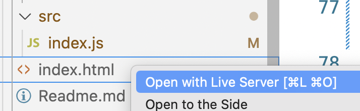
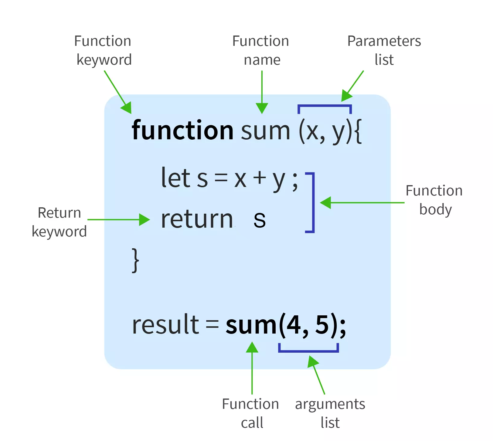
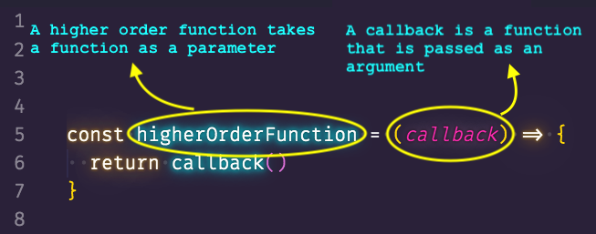

# Functions & Scope

---

### Guidelines

  

    
<iframe src='https://gfycat.com/ifr/SafeGloriousIslandcanary' frameborder='0' scrolling='no' width='100%' height='100%' style='position:absolute;top:0;left:0;' allowfullscreen></iframe>

 

  

  

  - The more you participate the more you learn! 
  - Use Zoom's Raise Hand feature {.fragment}
  - Protect the Zoom chat! {.fragment}
  - 🤯 The moment you are confused, raise your hand. You're not alone! {.fragment}
  - "I don't know" is OK. Guessing is also OK! Mistakes => Learning! {.fragment}
  - 📷 on 🙏 {.fragment}

  

---

### Coding Along (not required!)

  

    <iframe src="https://giphy.com/embed/VTc0g9IKEpLAk" width="480" height="480" frameBorder="0" class="giphy-embed" allowFullScreen></iframe>

  

  

  - it can help
  - it can also hurt 😬 {.fragment}
  - If you get stuck, take a screenshot and refocus on our discussion {.fragment}
  - 💡Everything is recorded! {.fragment}
  - Focus on high level understanding > implementation {.fragment}
  - Comfort solving errors and fixing bugs will come with practice and experience {.fragment}

  

---

### My Setup

##### VSCode extensions:

Extension | Description |
---------|----------|
 [Draw.io Integation](https://marketplace.visualstudio.com/items?itemName=hediet.vscode-drawio) | for making diagrams from within VSCode 
 [Live Server](https://marketplace.visualstudio.com/items?itemName=ritwickdey.LiveServer) | for opening a webpage in the browser that will reload when the code is saved.  
 [vscode-reveal](https://marketplace.visualstudio.com/items?itemName=evilz.vscode-reveal) | for opening the slide.md files in the browser to display slideshows
 [Tabnine AI Autocomplete](https://marketplace.visualstudio.com/items?itemName=TabNine.tabnine-vscode) | for code completion suggestions based on context

---

### Live Server

- 127.0.0.1 is the default internal loop IP for localhost.{.fragment}

---

### Lecture repository workflow

[lecture repo link](https://github.com/learn-co-curriculum/SENG-LIVE-041023-Phase-1-JS/blob/main/GIT.md)

- Fork
- Copy SSH url  {.fragment}
- Go to the directory where you want to download the code {.fragment}
- `$git clone <SSH url>` onto your local machine {.fragment}
- The next day, I'm going to add a new folder {.fragment}
- You would go back to the github repo {.fragment}
- Click on the `Sync fork` button {.fragment}
- Click on the `Update branch` button {.fragment}
- `$git pull origin main` {.fragment}

---

### Lecture Goals

- Describe what functions are
- Regular functions vs arrow functions syntax
- Explain the difference between:
  - Block scope
  - Function scope
  - Global scope
- Understand functions as first-class objects
- Identify higher-order functions
- Define callback functions and higher-order functions

---

### Functions

- Definition phase (Declaration phase)

- Invocation phase {.fragment}

---

### Functions

---

### Let's Code!

Function | Parameters | Behavior
---------|----------|---------
 helloWorld | none | returns "Hello, world!"
 formatPrice | price (float) | returns the price like so: "$2.99" 
 blurb | book (obj) | returns a string representation of the book with title author and price

---

#### Scope & The Scope Chain

[Awesome Blog post on Scope and the Scope Chain](https://medium.com/joonsikyang/scope-and-the-scope-chain-27216a853a4e)

---

### () => {} vs function() {}

- syntax {.fragment}

- simplified vs fully featured {.fragment}

- implicit return vs explicit return ["click"](https://developer.mozilla.org/en-US/docs/Web/JavaScript/Reference/Functions/Arrow_functions#function_body) {.fragment}

- interchangeable for now (hoisting! 😅) {.fragment}

- read more about ["click--> differences"](https://dmitripavlutin.com/differences-between-arrow-and-regular-functions/) (or feel free to bookmark for later) {.fragment}

----

### Callbacks and HOF

#### Higher Order Functions

- accept a function as a parameter
- (and/or) return a function

---

### Callbacks and HOF

---

### Callbacks and Iteration

---

### Links!

Resource | Location | Description
---------|----------|---------
 Starter Code | [GitHub Repo](https://github.com/learn-co-students/SENG-LIVE-101022-Phase-1-JS) | separate folder for each day's lecture contains the code and any related assets
 Recordings | [Google Sheet](https://docs.google.com/spreadsheets/d/139yeG9joHfaP8hT44z2iSLMv5ScLSc86ZKZ51csIfHo/edit#gid=0) | Links to the starter & solution code for each days video along with the video link and a notetaking doc you can use for practice 

---

## Resources

- [Differences between arrow functions and regular functions](https://dmitripavlutin.com/differences-between-arrow-and-regular-functions/)
- [Awesome Blog post on Scope and the Scope Chain](https://medium.com/joonsikyang/scope-and-the-scope-chain-27216a853a4e)